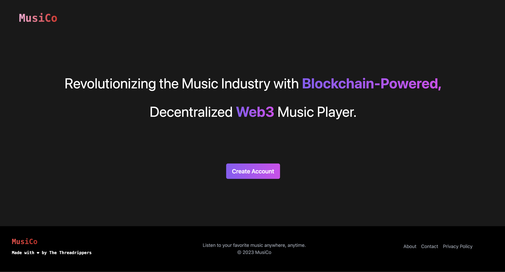

# MusiCo 
MusiCo is a web3 music player that converts your music files into NFTs.
This app is built for the hackathon *Hack Web3Conf India '23*

## Introduction
This project aims to revolutionize the music industry by developing a blockchain-powered, decentralized Web3 music player. The goal is to provide music artists with a platform to showcase their work and get rewarded directly by their fans using cryptocurrency payments.

## Features
* Decentralized music player that allows music artists to upload their work directly to the blockchain
* Built on Web3 technology, providing a decentralized, secure, and transparent platform for music artists and fans
* Community-driven curation of music content

## Technologies Used
* Ethereum Blockchain
* Solidity smart contract programming language
* IPFS (InterPlanetary File System) for decentralized file storage
* Web3.js library for interacting with the Ethereum blockchain
* JavaScript and Railwind CSS for website UI

## Contributors
* [Rakibul Hasan](https://github.com/rakibul-in)
* [Aarohi Mahi](https://github.com/aarohimahi03)
* [B N Vaishnavi](https://github.com/vaishnavi078)
* [Diya K Mutha](https://github.com/DiyaMutha)

